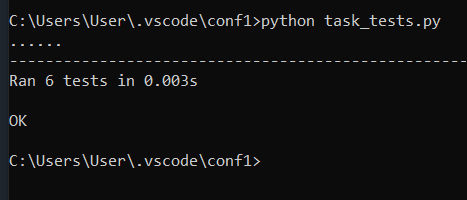
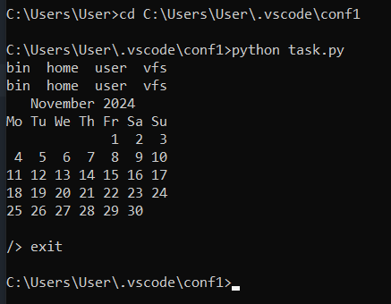

# Задание
Разработать эмулятор для языка оболочки ОС. Необходимо сделать работу эмулятора как можно более похожей на сеанс shell в UNIX-подобной ОС.
Эмулятор должен запускаться из реальной командной строки, а файл с виртуальной файловой системой не нужно распаковывать у пользователя.
Эмулятор принимает образ виртуальной файловой системы в виде файла формата **tar**. Эмулятор должен работать в режиме **CLI**.
___
Конфигурационный файл имеет формат **ini** и содержит:
- Путь к архиву виртуальной файловой системы.
- Путь к лог-файлу.
- Путь к стартовому скрипту.
___
Лог-файл имеет формат **xml** и содержит все действия во время последнего сеанса работы с эмулятором.

Стартовый скрипт служит для начального выполнения заданного списка команд из файла.

Необходимо поддержать в эмуляторе команды **ls**, **cd** и **exit**, а также следующие команды:
1. **uptime**
2. **cal**

Все функции эмулятора должны быть покрыты тестами, а для каждой из поддерживаемых команд необходимо написать 2 теста.
___
Ниже представлены результаты тестирования программы

